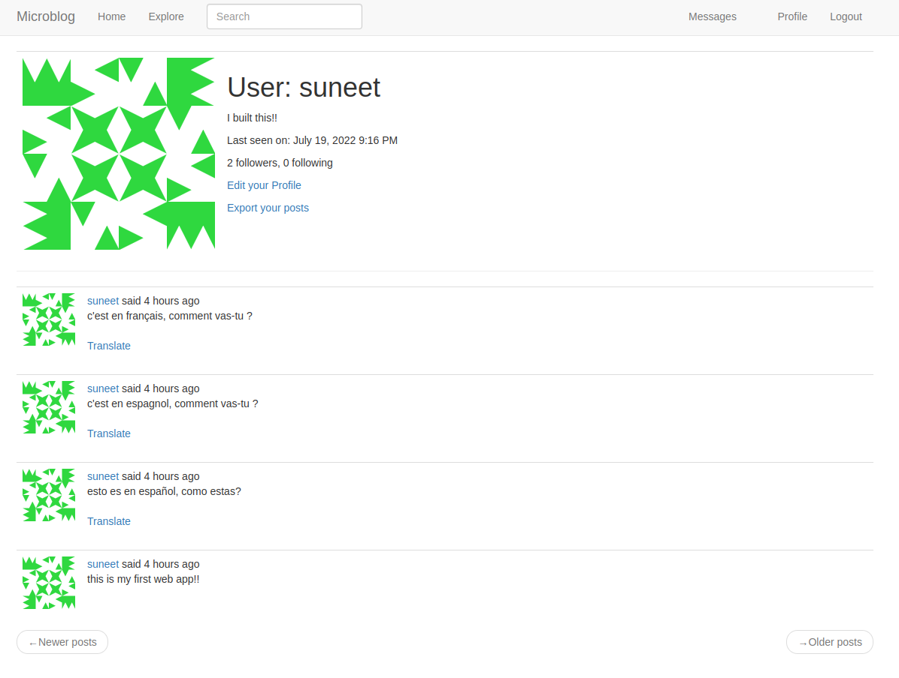

## MicroBlog


Microblog a web app that allows posting of short messages. This web app is built to primarily to demonstrate the usage of python's flask framework.

Deployed link - https://suneet-microblog.herokuapp.com/<br>
Note - Few of features are not active on the heroku deployment.  

## Features
- User authentication system
- Password recovery through Email
- Multiple language support
- Post translating support
- Full text search support
- Exporting of post data in json format (in background)
- API support for user and post data

### Built With
- Python's Flask
- SQLAlchemy (Database)
- Bootstrap
- JQuery

## Getting Started
The live translation of post is archived with the help of Microsoft translation service API. Hence, to implement this feature acquire your key from <a href='https://azure.microsoft.com/en-us/'> Microsoft Azure </a>

### Prerequisites

Install all dependencies given in the `requirements.txt` file using `pip`.
```bash
pip install -r requirements.txt
```
In addition to above, install <a href='https://www.elastic.co/elasticsearch/'>Elastic Search service </a>for full text search feature and <a href="https://redis.io/">Redis</a> for background exporting of post data.

### Installation

1. Clone the repo.
   ```bash
   git clone https://github.com/kajjidonisuneet/micro-blog.git
   ```
2. Start the elastic search and redis service in a separate terminals. Set a redis worker as below
   ```bash
   rq worker microblog-tasks
   ```
3. Set following environmental variables.
   ```bash
    SECRET_KEY=<secret key for password encryption>
    SQLALCHEMY_DATABASE_URI=<database url>
    MAIL_SERVER=<email server>
    MAIL_PORT=<email port>
    MAIL_USE_TLS=<email tls>
    MAIL_USERNAME=<email account username>
    MAIL_PASSWORD=<email account password>
    MS_TRANSLATOR_KEY=<MS translation API key>
    ELASTICSEARCH_URL=<url for elastic search server>
    FLASK_APP=microblog.py
   ```
4. In config.py set following variables:
   ```python
   ADMINS = ['email ids of admins']
   ```
5. Set up database with following commands:
   ```bash
   flask db init
   flask db migrate -m "messages"
   flask db upgrade
   ```
 6. launch flask server:
   ```bash
   flask db run
   ```
## Usage
#### Webapp
Webapp for most of the part is self explanatory.

#### API
Following are the API commands

1. For registering user
    ```bash
   http POST http://<server id>/api/users username=<username> password=<password> email=<email id> "about_me=<some text this is optional>"
   ```
2. For generating token
    ```bash
   http --auth <username>:<password> POST http://<server id>/api/tokens
   ```
3. To get single user details
    ```bash
   http GET http://<server id>/api/users/<user id> "Authorization:Bearer <token>"
   ```
 4. To get all user details
    ```bash
    http GET http://<server id>/api/users "Authorization:Bearer <token>"
    ```
 5. To get all the followers users details of a particular user 
    ```bash
    http GET http://<server id>/api/users/<user id>/followers "Authorization:Bearer <token>"
    ```
 6. To get all the followed users details of a particular user 
    ```bash
    http GET http://<server id>/api/users/<user id>/followed "Authorization:Bearer <token>"
    ```
 7. To edit the user details 
    ```bash
    http PUT http://<server id>/api/users/<user id> "about_me=<data you want to update>" "Authorization:Bearer <token>"
    ```
 8. To get the details of a single post 
    ```bash
    http GET http://<server id>/api/post/<post id> "Authorization:Bearer <token>"
    ```
 9. To get details of a all post of a particular user
    ```bash
    http GET http://<server id>/api/users/<user id>/posts "Authorization:Bearer <token>"
    ```
10. To add a post
    ```bash
    http POST http://<server id>/api/users/<user id>/posts "body=<text of the blog post>" "Authorization:Bearer <token>"
    ```
11. To get followed users post
    ```bash
    http GET http://<server id>/api/users/<user id>/followed_post "Authorization:Bearer <token>"
    ```

## Acknowledgments
This project is primary built by referring <a href='https://blog.miguelgrinberg.com/post/the-flask-mega-tutorial-part-i-hello-world' >The Flask Mega-Tutorial</a> by Miguel Grinberg.
